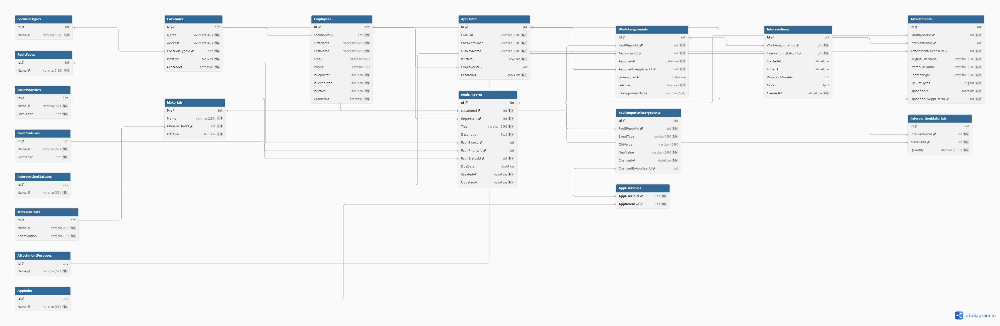

# e-Kvarovi Županije

Aplikacija za prijavu i obradu kvarova u županijskim zgradama i lokacijama (upravne zgrade, škole, zdravstvene ustanove, skladišta). Prijavitelj prijavi kvar sa svoje lokacije, upravitelj ga pregleda i odredi vrstu/prioritet pa dodijeli izvršitelju, a izvršitelj odrađuje jednu ili više intervencija (uključujući neuspješne, koje ostaju u povijesti), evidentira utrošeni materijal i fotografije prije/poslije, sve do zatvaranja prijave.

## Tehnologije

- .NET 10
- Blazor Web App, Interactive Server render mode
- MudBlazor 9.8.0
- ASP.NET Core Web API
- EF Core 10.0.11 + SQLite
- JWT autentikacija (Microsoft.AspNetCore.Authentication.JwtBearer 10.0.10)
- QuestPDF (generiranje PDF exporta)
- Swashbuckle/Swagger, samo u Development okruženju

## Struktura projekta

Solution ima tri projekta:

- `EKvarovi.App` - Blazor Web App (frontend). Sva komunikacija ide preko `HttpClient` + DTO modela, nema direktnog pristupa bazi ni EF Core-u.
- `EKvarovi.Api` - ASP.NET Core Web API - EF Core, JWT autentikacija i autorizacija, upload datoteka, sva poslovna logika.
- `EKvarovi.Shared` - DTO modeli i zajednički tipovi koje dijele App i Api.

## Model baze

Model je namjerno projektiran oko povijesti umjesto brisanja - dodjele izvršitelja (`WorkAssignments`) i intervencije (`Interventions`) se nikad fizički ne brišu niti prepisuju, nego se svaka promjena bilježi kao novi red (uz `FaultReportHistoryEvents` kao dodatnu vremensku crtu). DTO modeli za prikaz i za spremanje su odvojeni od entity modela baze - Blazor nikad ne vidi entity klase izravno.



Puni DBML izvor dijagrama nalazi se u `docs/database-model.dbml` - može se uvesti na [dbdiagram.io](https://dbdiagram.io) radi pregleda ili ponovnog izvoza slike, i drži se usklađen sa stvarnim EF Core modelima.

## Pokretanje projekta - detaljan vodič korak po korak

### 1. Preduvjeti

- .NET 10 SDK (oba projekta ciljaju `net10.0`, nema `global.json` koji bi fiksirao točniju verziju).
- Visual Studio s podrškom za .NET 10 SDK - preporučeno, ali nije obavezno.
- Alternativa bez Visual Studija: `dotnet` CLI (`dotnet build`, `dotnet run`) radi jednako dobro za sve korake u ovom vodiču.
- Na potpuno novom računalu (prvi put nakon kloniranja) obično je potrebno instalirati i potvrditi lokalni HTTPS razvojni certifikat: `dotnet dev-certs https --trust`. Detalji i rješavanje problema u sekciji [Rješavanje čestih problema](#rješavanje-čestih-problema) ispod.

### 2. Kloniranje repozitorija

```
git clone <URL-repozitorija>
```

Otvoriti `EKvarovi.sln` u Visual Studiju, ili samo raditi iz root foldera repozitorija ako se koristi CLI.

### 3. JWT tajni ključ (obavezno prije prvog pokretanja)

API se namjerno neće pokrenuti (fail-fast) dok `Jwt:Key` nije postavljen - u `EKvarovi.Api/Program.cs` se odmah kod starta baca:

> `Jwt:Key nije konfiguriran. Postavi ga preko: dotnet user-secrets set "Jwt:Key" "<dugacak nasumican string>" (u EKvarovi.Api folderu).`

Iz `EKvarovi.Api` foldera:

```
cd EKvarovi.Api
dotnet user-secrets set "Jwt:Key" "<vaš-dugačak-nasumičan-string,-minimalno-32-znaka>"
```

`Jwt:Issuer` i `Jwt:Audience` se čitaju iz iste `Jwt` sekcije, ali `appsettings.json` već sadrži prazne defaultne vrijednosti za njih (`""`), pa nisu obavezni - `EKvarovi.Api/Program.cs` uključuje `ValidateIssuer`/`ValidateAudience` samo ako je odgovarajuća vrijednost stvarno postavljena, pa je aplikacija sigurna za pokretanje i bez njih. Ako ih želite eksplicitno postaviti (stroža validacija tokena):

```
dotnet user-secrets set "Jwt:Issuer" "EKvarovi.Api"
dotnet user-secrets set "Jwt:Audience" "EKvarovi.App"
```

Tajne se ovako drže isključivo u `dotnet user-secrets` (izvan repozitorija), nikad u `appsettings.json` ili u Blazoru.

> **Česta greška (povijesna napomena):** Ranija verzija ovog projekta imala je `ValidateIssuer`/`ValidateAudience` bezuvjetno postavljene na `true` u `Program.cs`, dok su `Jwt:Issuer`/`Jwt:Audience` po defaultu prazan string u `appsettings.json`. Kad JWT biblioteka izda token s praznim issuer/audience, ona uopće ne upisuje `iss`/`aud` claim u token - a JWT middleware kod validacije tada odbija **svaki** token čim je `ValidateIssuer`/`ValidateAudience = true`, bez obzira što je i očekivana vrijednost prazna. Posljedica: prijava (`POST /api/auth/login`) uspije jer ne zahtijeva autentikaciju, ali svaki sljedeći poziv (npr. Dashboard) odmah puca s `401 Unauthorized`, a ni F5 ne pomaže jer je uzrok na API strani, ne u pohranjenom tokenu na klijentu. Ovo je sada popravljeno (validacija issuer-a/audience-a se automatski isključuje kad nisu postavljeni), pa gornji koraci za `Jwt:Issuer`/`Jwt:Audience` ostaju potpuno opcionalni. Ako se ipak pojavi 401 odmah nakon prijave, pogledajte [Rješavanje čestih problema](#rješavanje-čestih-problema).

### 4. Baza i migracije

Bazu nije potrebno ručno migrirati. `EKvarovi.Api/Program.cs` kod svakog starta poziva `dbContext.Database.Migrate()`, pa se sve migracije (`InitialCreate`, `AddSystemAppUserSeed`, `AddFaultReportHistory`) automatski primjene nad `EKvarovi.Api/EKvarovi.db` (SQLite datoteka koja se kreira ako ne postoji).

Ručno pokretanje `dotnet ef database update` iz `EKvarovi.Api` foldera (ili `Update-Database` u Visual Studio Package Manager Consoli) je i dalje moguće, ali potpuno opcionalno - krajnji rezultat je identičan jer `Program.cs` to već radi umjesto vas.

### 5. Seed podaci pri pokretanju

Odmah nakon migracija, `Program.cs` redom pokreće dva seedera:

- **`DemoDataSeeder`** - popunjava 8 lokacija (sve 4 vrste lokacije, uključujući jednu neaktivnu), 12 zaposlenika (mix prijavitelja/izvršitelja, neki su oboje), 8 materijala i 18 prijava kvarova raspoređenih kroz svih 6 statusa. Uključuje i povijest ponovne dodjele (jedna prijava reassignana s jednog izvršitelja na drugog), neuspješnu pa zatim uspješnu intervenciju na istoj dodjeli, utrošeni materijal na više intervencija, tri seed fotografije (uključujući uparen par prije/poslije), te potpuno popunjenu vremensku crtu (`FaultReportHistoryEvents`) za svaku prijavu.
- **`DemoUserSeeder`** - dodaje 4 demo korisnička računa (popis ispod), od kojih su Technician i Reporter računi eksplicitno povezani s konkretnim, imenovanim `Employee` zapisima iz `DemoDataSeeder`-a.

Oba seedera se pokreću pri svakom startu API-ja, ali se sami preskaču ako baza već ima podatke (`DemoDataSeeder` provjerava postoji li ijedna lokacija, `DemoUserSeeder` provjerava svaki korisnički email zasebno) - sigurno je pokretati API ponovno bez straha od duplih zapisa.

### 6. Pokretanje oba projekta

**Opcija A - Visual Studio:**

1. Desni klik na Solution → *Configure Startup Projects* → *Multiple startup projects* → postaviti `EKvarovi.Api` i `EKvarovi.App` na akciju **Start** → OK. (Ova konfiguracija je već spremljena u `EKvarovi.slnLaunch.user` u rootu repozitorija, pa ovaj korak može biti već gotov.)
2. **Važno:** u debug dropdown izborniku pored zelenog gumba Start, za `EKvarovi.Api` izričito odabrati launch profil **https** (ne `http`) - inače će API poslušati samo na portu 5153 bez porta 7094, na kojeg je App tvrdo vezan (vidi korak 7), pa se App neće moći spojiti na API.
3. F5.

**Opcija B - CLI, u dva odvojena terminala iz root foldera repozitorija:**

```
dotnet run --project EKvarovi.Api --launch-profile https
```

```
dotnet run --project EKvarovi.App --launch-profile https
```

`--launch-profile https` je obavezan za `EKvarovi.Api` iz istog razloga kao u koraku iznad - default profil (`http`) ne otvara port 7094.

### 7. Provjera da je API pokrenut

API sluša na `https://localhost:7094` (vidi `EKvarovi.Api/Properties/launchSettings.json`, profil `https`). Swagger je dostupan na:

```
https://localhost:7094/swagger
```

### 8. Otvaranje aplikacije

App sluša na `https://localhost:7061` (vidi `EKvarovi.App/Properties/launchSettings.json`, profil `https`). Preglednik bi se trebao sam otvoriti; ako se ne otvori, ručno otvorite:

```
https://localhost:7061/login
```

### 9. Prva prijava

Prijavite se bilo kojim demo računom iz tablice ispod (npr. `admin@ekvarovi.hr`). Odmah nakon prijave trebali biste vidjeti Dashboard popunjen demo podacima (brojke otvorenih/kritičnih/zakašnjelih prijava, SLA grafovi, zadnjih 5 prijava) zahvaljujući automatskom seedu iz koraka 5 - to je potvrda da je sve ispravno postavljeno.

### Provjera od nule (preporučeno prije predaje)

Za potpunu provjeru da ovaj vodič radi, obrišite lokalnu `EKvarovi.db` datoteku (ili klonirajte repozitorij u potpuno nov folder) i ponovite korake 3-9 od početka.

## Demo korisnički računi

**Admin**
- Email: `admin@ekvarovi.hr`
- Lozinka: `Lozinka123!`

**Manager**
- Email: `manager@ekvarovi.hr`
- Lozinka: `Lozinka123!`

**Technician** (povezan sa zaposlenikom Domagoj Perković)
- Email: `tehnicar@ekvarovi.hr`
- Lozinka: `Lozinka123!`

**Reporter** (povezan sa zaposlenikom Sara Kralj)
- Email: `prijavitelj@ekvarovi.hr`
- Lozinka: `Lozinka123!`

## Implementirane funkcionalnosti

### Obavezni dio

- Model s poviješću umjesto brisanja: `WorkAssignments` (povijest dodjela, filtrirani unique index osigurava najviše jednu aktivnu dodjelu po prijavi), `Interventions` (0..N intervencija po dodjeli, neuspješne ostaju trajno zabilježene), `InterventionMaterials` (M:N materijal↔intervencija s količinom), `Attachments`, `FaultReportHistoryEvents`.
- 4 uloge (Admin, Manager, Technician, Reporter) s autorizacijom i ownership provjerama na razini API kontrolera (`[Authorize(Roles = ...)]` + provjere u servisu) - ne samo skrivanje gumba u Blazoru.
- DTO modeli potpuno odvojeni od entity modela (`EKvarovi.Shared/DTOs` vs `EKvarovi.Shared/Models`).
- Server-side filtriranje, pretraga i sortiranje preko query parametara na `GET /api/faultreports` i `GET /api/interventions`.
- Lookup podaci (vrste kvara, prioriteti, statusi, jedinice mjere...) dohvaćaju se s `LookupsController`-a.
- Upload fotografija/dokumenata s validacijom: dopušteni content-typeovi `image/jpeg`, `image/png`, `image/webp` za fotografije i `application/pdf` za dokumente, maksimalno 10 MB, sigurno generirano fizičko ime (GUID), original naziv/content-type/veličina/vrijeme uploada spremljeni u bazi, brisanje uklanja i fizičku datoteku i DB zapis.
- JWT autentikacija (`POST /api/auth/login`, `GET /api/auth/me`) s rate-limitingom na login endpointu (5 pokušaja/min po IP adresi).
- `/mine` endpointi koji identitet čitaju isključivo iz JWT claima: `GET /api/faultreports/mine` (Reporter), `GET /api/work-assignments/mine` (Technician).
- Cijeli propisani tok statusa: Zaprimljeno → Pregledano → Dodijeljeno → U radu → Riješeno → Zatvoreno, s posebnim endpointima za pregled (`PUT /api/faultreports/{id}/review`) i zatvaranje (`PUT /api/faultreports/{id}/close` - dopušteno samo Admin/Manager, i samo ako postoji barem jedna uspješno završena intervencija).
- Upravljanje korisničkim računima (samo Admin) - kreiranje, dodjela uloga, deaktivacija, povezivanje računa s `Employee` zapisom.

### Bonus dio (iz specifikacije)

- Usporedba fotografija prije/poslije na profilu prijave, po intervenciji.
- Mobilna prilagodba sučelja (responzivni MudBlazor grid layout).
- SLA pokazatelji s grafovima po lokaciji i vrsti kvara (prosječno vrijeme rješavanja, postotak riješenih na vrijeme) - izračunava ih API, ne frontend.
- Vremenska crta (timeline) svih promjena na prijavi.

### AI funkcionalnosti

Implementirano iza `IAiService` sučelja s `MockAiService` implementacijom - radi bez ikakvog vanjskog API poziva ili ključa, kroz prepoznavanje ključnih riječi i deterministička pravila (konfigurabilno kroz `Ai:Provider` u konfiguraciji, radi zamjene za stvarni provider u budućnosti):

- Prijedlog vrste i prioriteta kvara na temelju opisa (`POST /api/ai/fault-report-suggestion`), prikazan unutar dijaloga za pregled prijave.
- Sažetak radnog naloga na temelju svih intervencija i utrošenog materijala (`GET /api/ai/work-order-summary/{workAssignmentId}`).

AI ovdje ništa sam ne sprema - samo vraća prijedlog; Admin/Manager ga mora ručno potvrditi kroz postojeći review flow prije nego se stvarno spremi.

### Dodatna poboljšanja (izvan obavezne specifikacije)

- Bulk dodjela izvršitelja (`POST /api/work-assignments/bulk`) - dodjela više odabranih prijava odjednom, uz preskakanje onih koje već imaju aktivnu dodjelu.
- Prikaz trenutnog opterećenja (workload) izvršitelja unutar dijaloga za dodjelu, prije nego se odabere kome dodijeliti.
- Export popisa prijava u CSV i PDF (`GET /api/faultreports/export/csv`, `GET /api/faultreports/export/pdf`), uz iste filtere kao i tablični prikaz.
- Globalna pretraga kroz cijelu aplikaciju (`SearchController` + pretraga u AppBar-u).
- Upozorenja za rokove na dashboardu (zakašnjele prijave, prijave kojima rok ističe u sljedeća 24h).
- Brzi filteri na popisu prijava (kritične, bez izvršitelja, ovaj tjedan, rok uskoro ističe).
- Ispis radnog naloga na posebnoj print stranici.
- Tamna tema.
- Personalizirani dashboard za Technician/Reporter korisnike (`GET /api/dashboard/personal`).
- Stranica "O aplikaciji".

## Rješavanje čestih problema

### "Unable to connect to web server https" ili greška o nesigurnoj HTTPS vezi

Obično se događa samo prvi put na novom računalu, kad lokalni ASP.NET Core razvojni HTTPS certifikat još nije instaliran/potvrđen. Riješite pokretanjem:

```
dotnet dev-certs https --trust
```

Ako ni to ne pomogne (certifikat postoji, ali je oštećen ili nevažeći), očistite ga i ponovno kreirajte:

```
dotnet dev-certs https --clean
dotnet dev-certs https --trust
```

Nakon toga ponovno pokrenite `EKvarovi.Api` i `EKvarovi.App` (korak 6 iznad).

### 401 Unauthorized odmah nakon prijave (na Dashboardu ili drugim stranicama)

Prijava (`POST /api/auth/login`) uspije, ali svaki sljedeći API poziv vraća 401 - najčešći uzrok je nepotpuno postavljen JWT tajni ključ u `dotnet user-secrets`. Provjerite koje su vrijednosti trenutno postavljene, iz `EKvarovi.Api` foldera:

```
dotnet user-secrets list
```

Jedino obavezno polje je `Jwt:Key` (bez njega se API uopće ne pokreće - vidi korak 3 iznad); `Jwt:Issuer`/`Jwt:Audience` su opcionalni i sigurni za izostaviti u trenutnoj verziji koda. Ako `Jwt:Key` nedostaje ili je slučajno prazan, postavite ga ponovno kao u koraku 3, pa ponovno pokrenite API (promjene u `user-secrets` se ne učitavaju bez restarta procesa). Ako je `Jwt:Key` postavljen, a 401 se svejedno pojavljuje odmah nakon prijave, provjerite i da ne postoji zaostali (stariji) `dotnet`/`EKvarovi.Api` proces koji već drži port 7094 iz prijašnjeg pokretanja - App bi se tada spajao na krivu instancu API-ja s drugačijim tajnim ključem.

## Sigurnost

JWT signing key ide isključivo kroz `dotnet user-secrets`, nikad u `appsettings.json` ili u git repozitorij. Lozinke su hashirane preko `PasswordHasher<AppUser>`, nikad spremljene kao čisti tekst. Autorizacija (uloge + ownership) provjerava se na API razini na svakom zaštićenom endpointu, ne samo skrivanjem akcija u Blazor sučelju. Login endpoint je dodatno zaštićen rate-limitingom protiv brute-force pokušaja.
